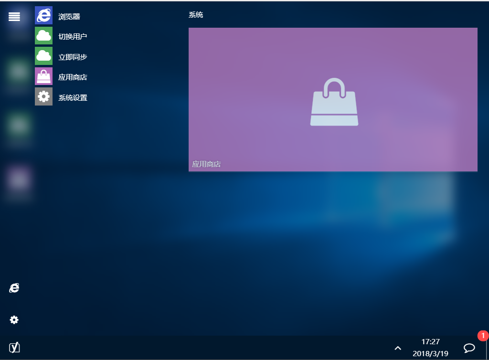

## 概念

### 定义

类似于单机游戏的存档，存档数据记录了当前系统运行状态，并能随时还原为这一状态，便于用户将自己的桌面状态保存或上传到远程服务器上，并能随时同步还原。

另外，如果开发者熟悉存档数据结构，能够通过编写程序批量修改存档数据。

### 结构

存档数据以JSON格式存在，保证了数据传输过程中的可序列化。
如果用js对象转化为JSON字符串，请保证这种转化是完全可逆的。

>js对象可以被JSON.stringify转化为JSON字符串，但是如果js对象成员中有函数，无限嵌套，带方法的对象等复杂的成员，则它的数据很可能会丢失。合法的存档数据应该由一系列的键名->键值(字符串、数字)及层级关系组成，是可以无损序列化的。

JSON数据的最外层形式如下，其中，`...`表示内部内容被省略。
~~~json
{
  "configs": {...},
  "apps": {...},
  "shortcuts": [...],
  "tiles":[...],
  "startMenu": {...}
}
~~~

| 键名      | 意义         |
| --------- | ------------ |
| configs   | 运行配置     |
| apps      | 应用程序池   |
| shortcuts | 桌面图标数据 |
| tiles     | 磁贴数据     |
| startMenu | 开始菜单数据 |

### 快速上手

官方的存档数据basic.json可以渲染出一个简单的、标准的桌面，参考此文件可以基本理解存档数据的结构。

附`basic.json`代码（v1.0.0）
~~~json
{
  "configs": {
    "topTaskBar": false,
    "pathRes": "./res",
    "sound": false,
    "shortcutsSortAuto": true,
    "wallpaper": "./res/img/wallpapers/bg1.jpg",
    "wallpaperBlur": true,
    "wallpaperSlide": false,
    "wallpaperSlideRandom": true,
    "wallpaperSlideItv": 1,
    "wallpaperSlideTime": 1519442460788,
    "wallpaperSlideIndex": 8,
    "openMax": 9,
    "idCounter": 94,
    "themeColor": "rgba(2,35,64,1)",
    "autoThemeColor": true,
    "wallpapers": [
      {
        "image": "./res/img/wallpapers/bg1.jpg",
        "preview": "./res/img/wallpapers/bg1_1.jpg"
      },
      {
        "image": "./res/img/wallpapers/bg2.jpg",
        "preview": "./res/img/wallpapers/bg2_1.jpg"
      },
      {
        "image": "./res/img/wallpapers/bg3.jpg",
        "preview": "./res/img/wallpapers/bg3_1.jpg"
      },
    ],
    "debug": false,
    "winBlur": true
  },
  "apps": {
    "yl-system": {
      "addressBar": false,
      "autoRun": 0,
      "background": false,
      "badge": 0,
      "desc": "YL-UI 系统设置面板",
      "icon": {
        "type": "fa",
        "bg": "gray",
        "content": "gear"
      },
      "openMode": "normal",
      "plugin": false,
      "position": {
        "x": "(x-860)/2",
        "y": "y*0.1",
        "left": true,
        "top": true,
        "autoOffset": false
      },
      "poweredBy": "Yuri2",
      "resizable": true,
      "single": true,
      "size": {
        "width": "860",
        "height": "y*0.8"
      },
      "title": "系统设置",
      "url": "./res/apps/system/index.html",
      "customTile": ""
    },
    "yl-color-picker": {
      "addressBar": false,
      "autoRun": 0,
      "background": false,
      "badge": 0,
      "desc": "简单的取色器",
      "icon": {
        "type": "fa",
        "bg": "#3289c7",
        "content": "eyedropper"
      },
      "openMode": "normal",
      "plugin": false,
      "position": {
        "x": "(x-207)/2",
        "y": "(y-239)/2",
        "left": true,
        "top": true,
        "autoOffset": false
      },
      "poweredBy": "Yuri2",
      "resizable": false,
      "single": true,
      "size": {
        "width": "207",
        "height": "239"
      },
      "title": "取色器",
      "url": "./res/apps/colorPicker/colorPicker.html",
      "customTile": ""
    },
    "yl-browser": {
      "addressBar": true,
      "autoRun": 0,
      "background": false,
      "badge": 0,
      "desc": "浏览器",
      "icon": {
        "type": "fa",
        "content": "internet-explorer",
        "bg": "#3a55c2"
      },
      "openMode": "normal",
      "plugin": false,
      "position": {
        "autoOffset": true,
        "left": true,
        "top": true,
        "x": "x*0.1",
        "y": "y*0.1"
      },
      "poweredBy": "Yuri2",
      "resizable": true,
      "single": false,
      "size": {
        "height": "y*0.8",
        "width": "x*0.8"
      },
      "title": "浏览器",
      "url": "./res/apps/browser/index.html",
      "customTile": ""
    },
    "yl-server-import": {
      "addressBar": false,
      "autoRun": 0,
      "background": false,
      "badge": 0,
      "desc": "",
      "icon": {
        "type": "fa",
        "content": "cloud",
        "bg": "#4da85b"
      },
      "openMode": "normal",
      "plugin": false,
      "position": {
        "autoOffset": true,
        "left": true,
        "top": true,
        "x": "x*0.1",
        "y": "y*0.1"
      },
      "poweredBy": "Yuri2",
      "resizable": true,
      "single": true,
      "size": {
        "height": "y*0.8",
        "width": "x*0.8"
      },
      "title": "YLUI云服务-同步",
      "url": "https://ylui.yuri2.cn/index.php/home/main/import",
      "customTile": ""
    },
    "yl-server-login": {
      "addressBar": false,
      "autoRun": 0,
      "background": false,
      "badge": 0,
      "desc": "",
      "icon": {
        "type": "fa",
        "content": "cloud",
        "bg": "#4da85b"
      },
      "openMode": "normal",
      "plugin": false,
      "position": {
        "autoOffset": true,
        "left": true,
        "top": true,
        "x": "x*0.1",
        "y": "y*0.1"
      },
      "poweredBy": "Yuri2",
      "resizable": true,
      "single": true,
      "size": {
        "height": "y*0.8",
        "width": "x*0.8"
      },
      "title": "YLUI云服务-登录",
      "url": "https://ylui.yuri2.cn/index.php/home/main/login",
      "customTile": ""
    },
    "yl-app-store": {
      "addressBar": false,
      "autoRun": 0,
      "background": false,
      "badge": 0,
      "desc": "",
      "icon": {
        "type": "fa",
        "content": "shopping-bag",
        "bg": "#b36aba"
      },
      "openMode": "normal",
      "plugin": false,
      "position": {
        "autoOffset": true,
        "left": true,
        "top": true,
        "x": "x*0.1",
        "y": "y*0.1"
      },
      "poweredBy": "Yuri2",
      "resizable": true,
      "single": true,
      "size": {
        "height": "y*0.8",
        "width": "x*0.8"
      },
      "title": "应用商店",
      "url": "./res/apps/app-store/index.html",
      "customTile": ""
    }
  },
  "shortcuts": [
    {
      "app": "yl-browser",
      "title": "浏览器",
      "params": {},
      "hash": ""
    },
    {
      "app": "yl-server-login",
      "title": "切换用户",
      "params": {},
      "hash": ""
    },
    {
      "app": "yl-server-import",
      "title": "立即同步",
      "params": {},
      "hash": ""
    },
    {
      "app": "yl-app-store",
      "title": "应用商店",
      "params": {},
      "hash": ""
    }
  ],
  "tiles": [
    {
      "title": "系统",
      "data": [
        {
          "x": 0,
          "y": 0,
          "w": 6,
          "h": 3,
          "app": "yl-app-store",
          "title": "应用商店",
          "i": "91",
          "params": {},
          "hash": ""
        }
      ]
    }
  ],
  "startMenu": {
    "sidebar": [
      {
        "app": "yl-browser",
        "title": "浏览器",
        "params": {},
        "hash": ""
      },
      {
        "app": "yl-system",
        "title": "系统设置"
      }
    ],
    "menu": {
      "itemPushed-85": {
        "app": "yl-browser",
        "title": "浏览器",
        "params": {},
        "hash": ""
      },
      "itemPushed-86": {
        "app": "yl-server-login",
        "title": "切换用户",
        "params": {},
        "hash": ""
      },
      "itemPushed-87": {
        "app": "yl-server-import",
        "title": "立即同步",
        "params": {},
        "hash": ""
      },
      "itemPushed-88": {
        "app": "yl-app-store",
        "title": "应用商店",
        "params": {},
        "hash": ""
      },
      "itemPushed-89": {
        "app": "yl-system",
        "title": "系统设置",
        "params": {},
        "hash": ""
      }
    }
  }
}
~~~
