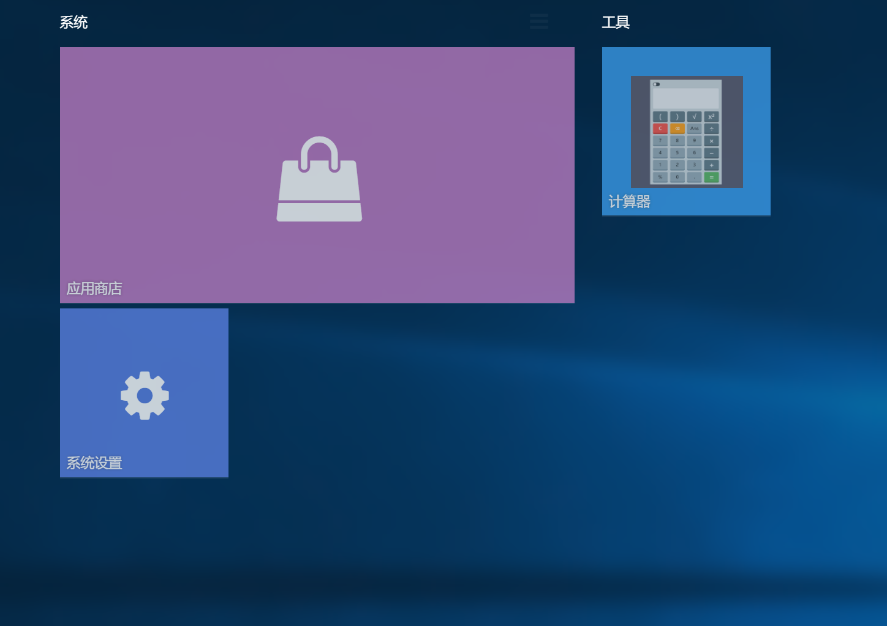

## 磁贴

磁贴是一种视觉冲击力很强的UI形式，但是其数据结构比较复杂，推荐用YLUI的可视化工具编辑。



```javascript
 "tiles": [
        {
            "title": "系统",
            "data": [
                {
                    "x": 0,
                    "y": 0,
                    "w": 6,
                    "h": 3,
                    "app": "yl-app-store",
                    "title": "应用商店",
                    "i": "91",
                    "params": {},
                    "hash": ""
                },
                {
                    "x": 0,
                    "y": 3,
                    "w": 2,
                    "h": 2,
                    "app": "yl-system",
                    "title": "系统设置",
                    "i": "110",
                    "params": {},
                    "hash": ""
                }
            ]
        },
        {
            "title": "工具",
            "data": [
                {
                    "x": 0,
                    "y": 0,
                    "w": 2,
                    "h": 2,
                    "app": "yl-calculator",
                    "title": "计算器",
                    "i": "109",
                    "params": {},
                    "hash": ""
                }
            ]
        }
    ]
```

磁贴本身由 x,y,w,h,app,title,i,params,hash描述

| 字段   | 类型   | 描述                       |
| ------ | ------ | -------------------------- |
| x      | int    | 左偏移                     |
| y      | int    | 上偏移                     |
| w      | int    | 宽度                       |
| h      | int    | 高度                       |
| app    | string | APP id                     |
| title  | string | 标题                       |
| i      | int    | key，对所有磁贴唯一        |
| params | json   | 类似于桌面图标的params定义 |
| hash   | string | 类似于桌面图标的hash定义   |

而磁贴是按组归类的，如上文的“工具”，“系统”。