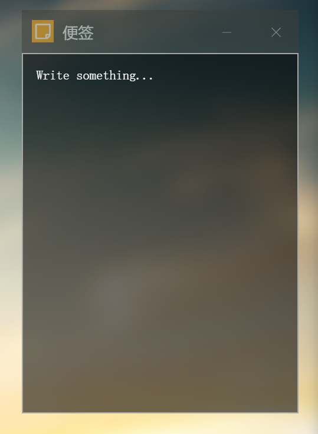

## APP高级特性

APP的表现形式不仅仅可以是一个个窗口，还可以为动态壁纸，小工具，后台服务等，取决于开发者的想象力。

下面我们将以几个特殊APP为例，探索如何利用APP的高级特性。

### 便签

便签用于快速记录信息，设计为一个小窗口，自启动于屏幕右上角。



* 便签作为小工具，需要低调。设置`plugin:true`，默认隐藏标题栏

* 每次启动自动出现在右上角，设置上对齐，右对齐，偏移4px

* 自启动级别设置为2

* 不需要用户改动url，设置地址栏默认隐藏`addressBar: false`

* 固定一个合适的尺寸宽度250px，高度320px

  ​

完整的便签APP数据

```javascript
		"plugin-note": {
            "addressBar": false,
            "autoRun": 2,
            "background": false,
            "badge": 0,
            "desc": "",
            "icon": {
                "type": "fa",
                "bg": "orange",
                "content": "sticky-note-o"
            },
            "openMode": "normal",
            "plugin": true,
            "position": {
                "x": "4",
                "y": "4",
                "left": false,
                "top": true,
                "autoOffset": false
            },
            "poweredBy": "Yuri2",
            "resizable": true,
            "single": true,
            "size": {
                "width": 250,
                "height": 326
            },
            "title": "便签",
            "url": "./res/apps/note/index.html",
            "customTile": ""
        }
```
### 时钟

类似于便签，但是时钟不需要交互操作，可以变得更低调。


我们希望用户根本不会触碰到它，设置`background:true`开启背景模式，让这个时钟成为一个背景装饰。

完整的时钟APP数据

```javascript
		"plugin-clock": {
            "addressBar": true,
            "autoRun": 2,
            "background": true,
            "badge": 0,
            "desc": "",
            "icon": {
                "type": "fa",
                "bg": "rgb(238,37,96)",
                "content": "clock-o"
            },
            "openMode": "normal",
            "plugin": true,
            "position": {
                "left": false,
                "top": false,
                "x": "0",
                "y": "0"
            },
            "poweredBy": "unknown",
            "resizable": true,
            "single": true,
            "size": {
                "width": 336,
                "height": 383
            },
            "title": "创意时钟",
            "url": "./res/apps/React Morph Clock/index.html",
            "customTile": ""
        }		
```

### 动态壁纸

那么动态壁纸的特性是什么？

* 覆盖整个屏幕
* 自动启动
* 无交互
* 位于最底层

结合上述两个例子，你是否能写出一个动态壁纸的APP数据？

> 位于最底层意味着该APP的启动顺序要足够靠前，它优先启动，后启动的的APP才能正确的覆盖在它上方。