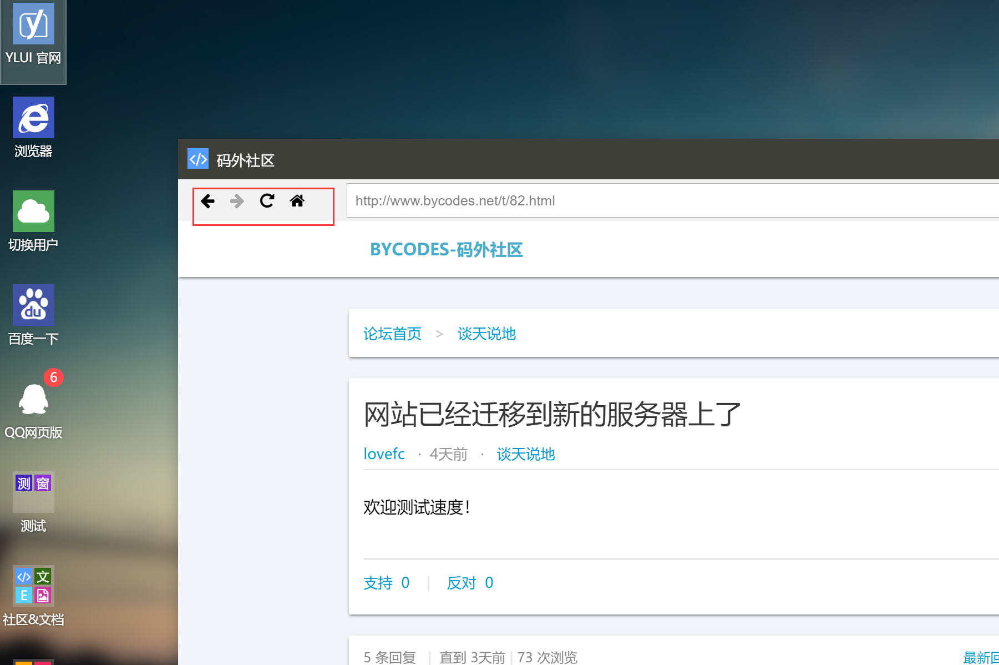
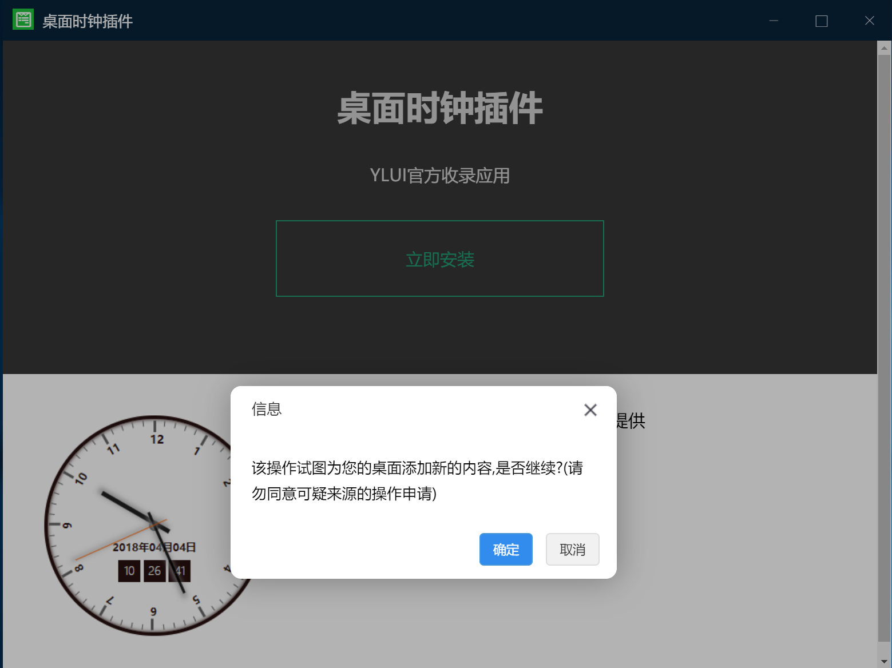

## 窗体API

窗体API指窗体在运行过程中可以使用的API，得益于YLUI精巧的设计，跨域的窗体也能实现一些强大的功能。

> 对于同域的窗体，可以使用`parent.window`来获取父窗体（YLUI主体）的所有全局对象，自然也就可以为所欲为。但是我们依然推荐开发者使用YLUI的窗体API模式，来获取更安全、更低耦合的开发体验。

### 开始

首先要使用 窗体API ，我们需要在窗体页面引入js文件：`/res/yl.app.js`，你可以将这个文件放置在其他位置，只要能正确加载到即可。

没错，对于最基本的使用，只需要加载yl.app.js文件，你甚至不需要写其他代码。

### 功能

成功接入窗体API 后，窗体将获得以下特性

* 支持在YLUI的地址栏中前进后退
* 支持F5刷新窗体而不是整个页面
* 直接获取同域的，其他子窗体的window对象
* 检测窗体是否运行于YLUI框架下，如果是，触发回调
* 窗体通信（高级）



------------------------------------------

### YLApp.id

每个窗体被打开，YLUI都会为它分配一个id。子窗口通过`YLApp.id`可以获取。

如果获取后为空，可能是当前APP不是运行在YLUI下，或尚未初始化。

### YLApp.data

data是这个窗体在被创造时赋予的数据，常被用于窗体通信。

> 例如，通过这个窗体a新建一个窗体b，可以为b的data赋值`parent:a的id`来标记创建者。

### YLApp.open(url)

*url string 打开新窗体的url地址*

立即在YLUI中打开一个新窗口。此处参数只有一个url，简单而常用的一个API。

> 可以替代传统的a标签打开新窗口。

### YLApp.onEvent(cb)

*cb function 回调函数*

接受到YLUI事件时触发，cb为事件处理函数（高级）。

YLUI主体会广播一些公共事件，它们分别为

* dataChanged 存档数据已被用户变更（监听此事件，上传用户的最新存档数据至你的数据库）
* open 某窗体被打开
* close 某窗体被关闭
* desktopMouseMove 桌面鼠标移动
* desktopMouseDown 桌面鼠标按下
* desktopMouseUp 桌面鼠标抬起
* desktopClick 桌面鼠标点击
* resize 主窗体尺寸改变

>  未来会加入更多公共事件

###YLApp.getWinObject(id)

*id string 目标窗体id*

*return window object*

获取指定窗体的window对象，仅在同域有效。

### YLApp.onEvent(cb)

*cb function 回调函数*

接受到YLUI事件时触发，cb为事件处理函数（高级）。

### YLApp.emit(event,data,target)

*event string 事件名*

*data mixed 数据*

*target string|array|true 广播对象*

发送一个事件。其中。如果target是string类型，表示发送给对应id的窗口；如果target是数组，表示发送给数组中所有id对应的窗体；如果target为true，表示发送给所有窗体。

> 特别的，YLUI主体的id为0。

---------------------------------------------------------------------------

### YLApp.eval(method,data, cb)

*method string 方法名*

*data mixed 数据*

*cb function 回调函数*

主动向YLUI发布指令或请求数据，完成后触发回调，请求结果会传递到回调函数的第一个参数上。


#### YLUI提供了很多方法可供窗体使用，它们统一使用`YLApp.eval`的形式。

> 参数为id的方法，如果id为空，则默认是当前窗体的id

| method                  | data          | return | 描述                                     |
| ----------------------- | ------------- | ------ | ---------------------------------------- |
| getID                   |               | int    | 返回YLUI的一个id流水号                   |
| getVersion              |               | string | 返回YLUI的当前版本                   |
| historyBack             | string id     |        | 指定id窗体后退                           |
| historyBackAvailable    | string id     | bool   | 指定id窗体是否可以后退                   |
| historyForward          | string id     |        | 指定id窗体前进                           |
| historyForwardAvailable | string id     | bool   | 指定id窗体是否可以前进                   |
| refresh                 | string id     |        | 刷新指定id窗体 |
| setWinData              | object data   |        | 设置当前窗体的数据                       |
| getWinData              |               | object | 获取当前窗体的数据                       |
| setWallpaper            | string urlImg |        | 设置壁纸为urlImg图片                     |
| setThemeColor           | string color  |        | 设置主题色                     |
| getConfigs |  | object | 获取配置 |
| getRuntime |  | object | 获取运行时数据 |
| open | object\|array data | string | 打开窗体，返回窗体id。具体调用方式参看`7.1全局API YL.open`，其中，data为array对应了`YL.open`两个参数的用法 |
| close | string id | | 关闭指定id的窗体，如果未指定id，关闭本窗体 |
| minimize | string id | | 最小化指定id的窗体 |
| maximize | string id | | 最大化指定id的窗体 |
| hide | string id | | 隐藏指定id的窗体 |
| show | string id | | 显示指定id的窗体 |
| restore | string id | | 还原指定id的窗体 |
| msg | array data | | 推送消息。data[0]为标题，data[1]为正文 |
| simpleMsg | string data | | 发送简单的文本提示信息 |
| setAppBadge | array\|string\|int data | bool | 设置APP的角标值；如果data为数组，data[0]为角标值，data[1]为APP id；如果data为数字或字符串，设置窗口所属APP的角标为data；返回操作是否成功 |
| getAppVersion | string id | string | 返回指定id窗体或当前窗体所属APP的版本号 |
| uninstall | string\|array data | | 卸载应用。data为string卸载指定id的应用，data为array卸载多个应用 |
| import | object data | | 【需要受信任APP权限】导入数据，重载YLUI |
| export |  | object | 【需要受信任APP权限】导出YLUI存档数据 |
| eval | string data | | 【需要受信任APP权限】在YLUI主体执行eval |
| setup | object data | | 安装。见下文 |

#### setup

setup是比较复杂而强大的指令，可以为YLUI动态添加APP和快捷方式。利用它你可以很快打造出一个YLUI应用商店。





data 的数据结构如下。其中，每一项不是必须存在的（比如只想添加图标不想添加磁贴，则可以省去tiles属性）。

```
{
    apps:{...},
    shortcuts:[...],
    sidebar:[...],
    tiles:[...],
    menu:{...},
}
```

* apps 需要传入多个新增/修改app的数据结构，形如`{my_app1_id:{my app1 data ...},my_app2_id:{my app2 data ...}}`。

  > APP的数据格式可以参阅`6.3应用程序池`。

* shortcuts 需要新增的多个桌面图标数据，形如`[{data1 ...},'my_app2_id']`，相当于调用了`YL.addShortcut`函数。

* sidebar 需要新增的多个侧边栏按钮的数据，形如`[{data1 ...},'my_app2_id']`，相当于调用了`YL.addSidebarBtn`函数。

* tiles 需要新增的多个磁贴的数据，形如`[{data1 ...},'my_app2_id']`，相当于调用了`YL.addTile`函数。

* menu 需要新增的多个菜单项的数据，形如`{item1_id:{item1_data ...},item2_id:{item2_data ...}}`。

  > 注意菜单项的id不能与其他项重复。菜单项的数据格式可以参阅`6.6开始菜单`。
